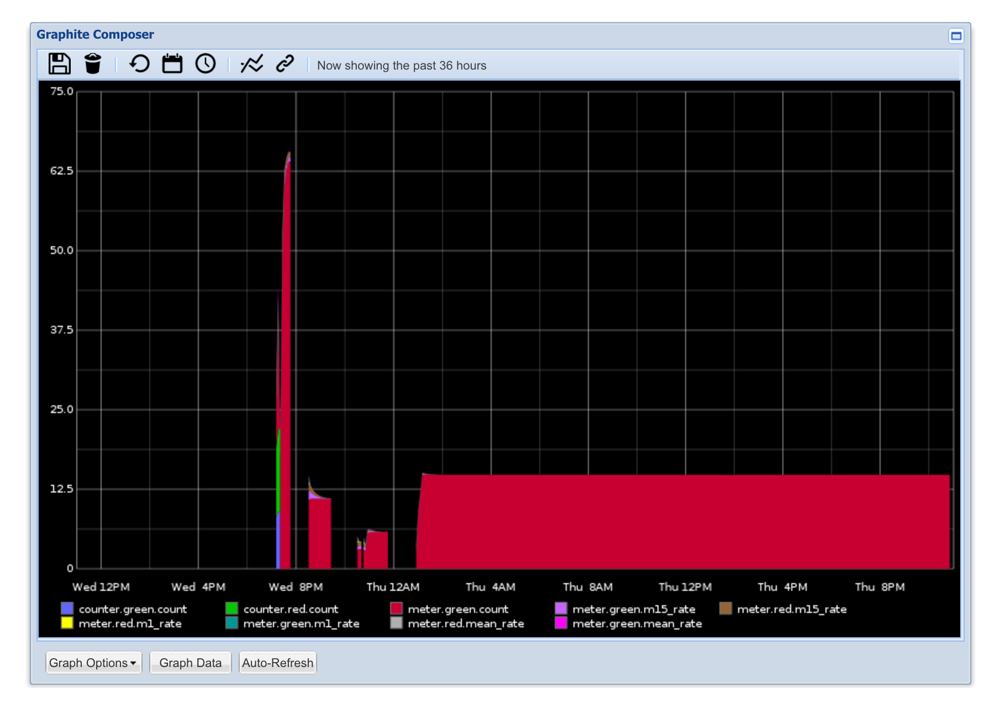
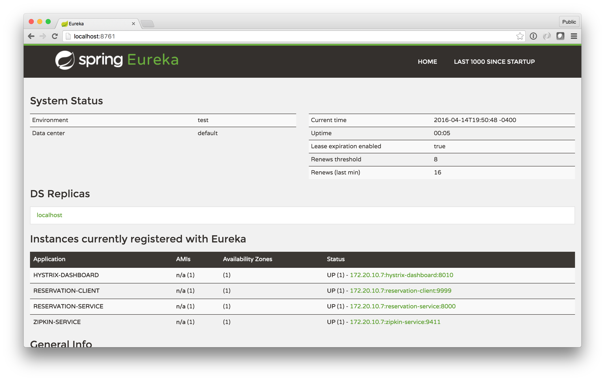
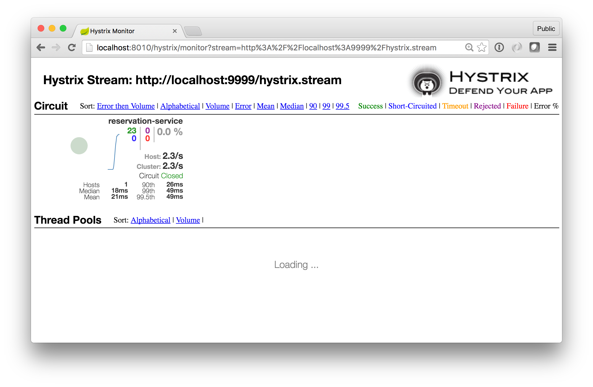
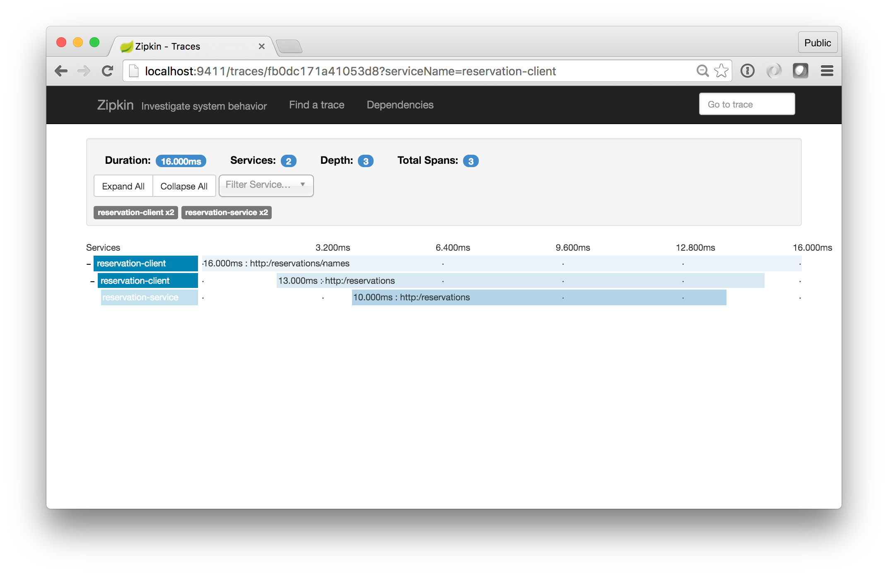

# The Power, Patterns and Pains of Microservices
 by [Josh Long](http://twitter.com/starbuxman)


## Survival is Not Mandatory
> It is not necessary to change. Survival is not mandatory. -W. Edwards Deming

In today's hypercompetitive international market, _all_ businesses are software businesses (or they're quickly replaced by software businesses) and speed-to-market is a differentiator, sometimes _the only_ one! Organizations look for small batches of work that they can move from concept to production, quickly. These small batches of work demand fewer people to finish, are easier to iterate on, and can be moved to production independently; they are microservices.

It is critical that an organization be prepared to address the complexities of standing up new services and to address the complexities implied by moving to a distributed systems world.

### Moving Beyond the Wiki Page: "500 Easy Steps to Production"

Microservices are APIs. How quickly can you standup a new service? Microframeworks like [Spring Boot](http://start.spring.io), [Grails](http://grails.org), [Dropwizard](http://dropwizard.io), [Play framework](https://www.playframework.com/) and [Wildfly Swarm](http://wildfly.org/swarm/) are optimized for quickly standing up REST services with a minimum of fuss. Extra points go to technologies that make it easy to build smart, self-describing _hypermedia_ APIs as Spring Boot does with Spring HATEOAS.

### You Can't Fix What You Can't Measure
A microservice must support visibility and transparency, indicators of its own state and of system state, in a single-pane-of-glass experience. The [DropWizard Metrics library](http://www.dropwizard.io) is one of the more popular approaches to capturing application metrics (gauges, meters, histograms, and counters). [Spring Boot's _Actuator_](http://start.spring.io) module provides deep integration with the DropWizard Metrics library, and supports exposing health endpoints, environment information, endpoint mapping information, request logs, and more. Time-series databases like Statsd, Graphite, InfluxDB and OpenTSDB support visualization and processing of metrics. DropWizard Metrics and Spring Boot Actuator can transparently export collected metrics to these time-series databases.


```java
@SpringBootApplication
public class DemoApplication {

  public static void main(String args[]) {
    SpringApplication.run(DemoApplication.class, args);
  }

  @Bean
  GraphiteReporter graphite(@Value("${graphite.prefix}") String prefix,
            @Value("${graphite.url}") URL url,
            @Value("${graphite.port}") int port,
            MetricRegistry registry) {

    GraphiteReporter reporter = GraphiteReporter.forRegistry(registry)
      .prefixedWith(prefix)
      .build(new Graphite(url.getHost(), port));
    reporter.start(1, TimeUnit.SECONDS);
    return reporter;
  }
}

@RestController
class FulfillmentRestController {

  @Autowired
  private CounterService counterService;

  @RequestMapping("/customers/{customerId}/fulfillment")
  Fulfillment fulfill(@PathVariable long customerId) {
    // ..
    counterService.increment("meter.customers-fulfilled");
    // ..
  }
}
```




Log multiplexers like Logstash or Cloud Foundry's Loggregator funnel the logs from application instances and ship them to downstream log analysis tools like ElasticSearch, Splunk, or PaperTrail.

Getting all of this out of the box is a good start, but not enough. There is often much more to be done before a service can get to production. Spring Boot uses a mechanism called auto-configuration that lets developers codify things - identity provider integrations, connection pools, frameworks, auditing infrastructure, literally _anything_ -  and have it stood up as part of the Spring Boot application just by being on the CLASSPATH _if_ all the conditions stipulated by the auto-configuration are met! These conditions can be anything, and Spring Boot ships with many common and reusable conditions: is a library on the `CLASSPATH`? Is a bean of a certain type defined (or not defined)? Is an environment property specified? Starting a new service need not be more complex than a `public static void main` entry-point and a library on the `CLASSPATH` if you use the right technology.

### Centralized Configuration
The [12 Factor manifesto](http://12factor.net/) provides a set of guidelines for building applications with good, clean cloud hygiene. One tenant is that environment specific configuration should live external to the application itself. It might live in environment variables, `-D` arguments, externalized `.properties`, and `.yml` files, or any other place, so long as the application code itself need not be recompiled.  Dropwizard, Spring Boot, [Apache Commons Configuration](http://commons.apache.org/proper/commons-configuration/) and others support this foundational requirement. However, this approach fails a few key use-cases: how do you change configuration centrally and propagate those changes? How do you support symmetric encryption and decryption of things like connection credentials? How do you support _feature flags_ which toggle configuration values at runtime, without restarting the process?

[Spring Cloud](http://start.spring.io) provides the Spring Cloud Config Server which stands up a REST API in front of a version controlled repository of configuration files, and Spring Cloud provides support for using Apache Zookeeper and Hashicorpo Consul as configuration sources. Spring Cloud provides various clients for all of these so that all properties, whether they come from the Config Server, Consul, a `-D` argument or an environment variable, work the same way for a Spring client. Netflix provides a solution called [Archaius](https://github.com/Netflix/archaius) which acts as a client to a pollable configuration source. This is a bit too low-level for many organizations and lacks a supported, open-source configuration source counterpart, but Spring Cloud bridges the Archaius properties with Spring's, too.


*the Config Server*

```properties
# application.properties
spring.cloud.config.server.git.uri=https://github.com/joshlong/my-config.git
server.port=8888
```

```java
@EnableConfigServer
@SpringBootApplication
public class ConfigServiceApplication {

	public static void main(String[] args) {
		SpringApplication.run(ConfigServiceApplication.class, args);
	}
}
```

*the Config Client*

```properties
# application.properties
spring.cloud.config.uri=http://localhost:8888
spring.application.name=message-client
# will read https://github.com/joshlong/my-config/message-client.properties
```

```java
@SpringBootApplication
public class ConfigClientApplication {

	public static void main(String[] args) {
		SpringApplication.run(ConfigClientApplication.class, args);
	}
}

// supports dynamic re-configuration:
// curl -d{} http://localhost:8000/refresh
@RestController
@RefreshScope
class MessageRestController {

	@Value("${message}")
	private String message;

	@RequestMapping("/message")
	String read() {
		return this.message;
	}
}
```

### Service Registration and Discovery
DNS is sometimes a poor fit for intra-service communication. DNS benefits from layers of caching and time-to-liveness that works against services in a dynamic cloud environment. In most cloud environments, DNS resolution requires a trip out of the platform to the router and then back again, introducing latency. DNS doesn't provide a way to answer the question: is the service I am trying to call still alive and responding? A request to such a fallen service will block until the service responds, unless the client specifies a timeout (which it should!). DNS is often paired with load-balancers, but third-party load-balancers are not sophisticated things: they may support round-robin load-balancing, or even availability-zone aware load-balancing, but may not be able to accomodate business-logic specific routing like routing a request with an OAuth token to a specific node, or routing requests to nodes collocated with data, etc.) It's important to decouple the client from the location of the service, but DNS might be a poor fit. A little bit of indirection is required. A service registry provides that indirection. A service registry is a phonebook, letting clients look up services by their logical name. There are many such service registries out there.  [Netflix's Eureka](https://github.com/Netflix/eureka), [Apache Zookeeper](https://zookeeper.apache.org/), and [Hashicorp Consul](https://www.consul.io/) are three good examples. Spring Cloud's `DiscoveryClient` abstraction provides a convenient client-side API implementations for working with service registries.



```java
@Autowired
public void enumerateServiceInstances(DiscoveryClient client){
  client.getInstances("reservation-service")
      .forEach( si -> System.out.println( si.getHost() + ":" + si.getPort() ));
}

```

### Client Side Load Balancing
A big benefit of using a service registry is client-side load-balancing. Client-side load-balancing let's the client pick from among the registered instances of a given service - if there are 10 or a thousand they're all discovered through the registry - and then choose from among the candidate instances which one to route  requests to. The  client can programmatically decide based on whatever criteria it likes - capacity, round-robin, cloud-provider availability-zone awareness, multi-tenancy, etc., to which node a request should be sent. Netlfix provide a great client-side load-balancer called [Ribbon](https://github.com/Netflix/ribbon). Spring Cloud readily integrates Ribbon and it is automatically in play at all layers of the framework, whether you're using the `RestTemplate`, declarative REST clients powered by Netflix's Feign, or the Zuul microproxy.

```java
@EnableDiscoveryClient
@SpringBootApplication
public class ReservationClientApplication {

	@Bean
	@LoadBalanced  // lets us use service registry service IDs as hosts
	RestTemplate restTemplate() {
		return new RestTemplate();
	}

	public static void main(String[] args) {
		SpringApplication.run(ReservationClientApplication.class, args);
	}
}

@RestController
class ApiClientRestController {

  @Autowired
  private RestTemplate restTemplate;

  @RequestMapping(method = RequestMethod.GET, value = "/reservations/names")
  public Collection<String> names() {

    ResponseEntity<JsonNode> responseEntity =
      restTemplate.exchange("http://reservation-service/reservations",
        HttpMethod.GET, null, JsonNode.class);
    // ...
  }
}
```

### Edge Services: Micro Proxies and API Gateways

Client-side load-balancing works for intra-service communication, usually behind a firewall. External clients - iPhones, HTML5 clients, Android clients, etc. - have client-specific security, payload and protocol requirements. An edge service may proxy or mediate requests and replies between the system of services and the clients. An edge service is exposed via DNS and forwards requests using service discovery. Edge services are intermediaries and an ideal place to insert API translation or protocol translation.  HTML5 clients, for example, exist in a sandbox and must issue requests to the same origin host and port. HTML5 clients may reach across their origin server to other resources so long as those resources have been configured to support CORS. This requirement is untenable and unscalable as you add more clients connecting to more microservices.  A microproxy, like [Netflix's Zuul](https://github.com/Netflix/zuul) forwards all requests at the edge service to  microservices, often to those it discovers in a service registry. If your application is an HTML5 application it might be enough to standup a microproxy, insert HTTP BASIC or OAuth security, support HTTPS, and be done with it.

Sometimes the client needs a coarser-grained view of the data coming from the services. This implies API translation. An edge service, stood up using something like Spring Boot, might use Reactive programming technologies like [Netflix's RxJava](https://github.com/ReactiveX/RxJava), Typesafe's [Akka](http://Akka.io), [RedHat's Vert.x](http://vertx.io/), and [Pivotal's Reactor](http://projectreactor.io/)  to compose requests and transformations across multiple services into a single response. Indeed, all of these technologies implement a common API called the [reactive streams API](http://www.reactive-streams.org/) because this subset of problems is so common.


An edge service is the last line of defense from the outside world and must be tolerant to service outages and failure.

```java
@EnableZuulProxy
@EnableCircuitBreaker
@EnableDiscoveryClient
@SpringBootApplication
public class EdgeServiceApplication {

  public static void main(String[] args) {
    SpringApplication.run(EdgeServiceApplication.class, args);
  }
}

@RestController
class TradesStreamingApiGateway {

  @Autowired
  private MarketService marketService;

  @RequestMethod(method=HttpMethod.GET, value = "/market/trades")
  public SseEmitter trades() {
    SseEmitter sseEmitter = new SseEmitter();
    Observable<StockTrade> trades = marketService.observeTrades();  // RxJava
    trades.subscribe( value -> publishNewTrade(sseEmitter, value),
      sseEmitter::completeWithError,
      sseEmitter::complete
    );
    return sseEmitter;
  }

  private void publishNewTrade(SseEmitter sseEmitter, Trade t) {
    try {
      sseEmitter.send(t);
    } catch (IOException e) {
      e.printStackTrace();
    }
  }
}
```


### Clustering Primitives
In a complex distributed systems, there are many actors with many roles to play. Cluster coordination and cluster consensus is one of the most difficult problems to solve. How do you handle leadership election, active/passive handoff or global locks? Thankfully,  many technologies provide the primitives required to support this sort of coordination, including Apache Zookeeper, [Redis](http://redis.io) and [Hazelcast](https://hazelcast.com/). [Spring Cloud's Cluster](http://start.spring.io) support provides a clean integration with all of these technologies.

```java
@Component
class LeadershipApplicationListener {

  @EventListener
  public void leadershipGranted(OnGrantedEvent evt){
    // ..
  }

  @EventListener
  public void leadershipRevoked(OnRevokedEvent evt){
    // ..
  }
}
```

### Messaging, CQRS and Stream Processing
When you move into the world of microservices, state synchronization becomes more difficult. The reflex of the experienced architect might be to reach for distributed transactions, a la JTA. Ignore this urge at all costs. Transactions are a stop-the-world approach to state synchronization and slow the system as a whole; the worst possible outcome in a distributed system. Instead, services today use eventual consistency through messaging to ensure that state eventually reflects the correct system worldview. REST is a fine technology for _reading_ data but it doesn't provide any guarantees about the propagation and eventual processing of a transaction. Actor systems like [Typesafe Akka](http://akka.io) and message brokers like [Apache ActiveMQ](http://activemq.apache.org/), [Apache Kafka](http://kafka.apache.org/), [RabbitMQ](http://rabbitmq.com) or [even Redis](http://redis.io/) have become the norm. Akka provides a supervisory system guarantees a message  will be processed at-least once. If you're using messaging, there are many APIs that can simplify the chore including [Apache Camel](http://camel.apache.org/), [Spring Integration](http://projects.spring.io/spring-integration/) and - at a higher abstraction level  - Spring Cloud Stream. Using messaging for writes and use REST for reads optimizes reads separately from writes. The  [Command Query Responsibility Segregation](http://martinfowler.com/bliki/CQRS.html), or CQRS, design pattern specifically describes this approach.

```java

@EnableBinding(CrmChannels.class)
@SpringBootApplication
public class ProductsEdgeService {

	public static void main(String[] args) {
		SpringApplication.run(ReservationClientApplication.class, args);
	}
}

interface CrmChannels {

  @Output
  MessageChannel orders();

  @Output
  MessageChannel customers();

  @Output
  MessageChannel products();
}


@RestController
@RequestMapping("/products")
class ProductsApiGatewayRestController {

  @Autowired
  private MessageChannel products;

  @RequestMapping(method = RequestMethod.POST)
  public void write(@RequestBody Product p) {
    Message<Product> msg = MessageBuilder.withPayload (p).build();
    products.send(msg);
  }
}
```

```java
@EnableBinding(Sink.class)
public class ProductHandler {

  @Autowired
  private ProductRepository products;

  @StreamListener(Sink.INPUT)
  public void handle(Product p) {
    products.addProduct(vote);
  }
}
```

### Circuit Breakers
Circuit breakers, like [Netflix's Hystrix](https://github.com/Netflix/Hystrix) or [JRugged](https://github.com/Comcast/jrugged), help prevent a downstream service from being overwhelmed and help isolate failures, permitting downstream services time to recover.  Systems are complex, living things. Failure in one system can trigger a domino effect across other systems if care isn't taken to isolate them.  A circuit breaker will slowly attempt to reintroduce traffic. Circuit breakers represent connections between services in a system; it is important to monitor them. Hystrix provides a dashboard for its circuits. Wildfly Swarm has support for using Hystrix. The [Play framework](https://www.playframework.com/) provides support for circuit breakers.   Spring Cloud also has deep support for Hystrix and the dashboard, as well as multiplexing the server-sent event streams emitted from different components into a single stream using Spring Cloud Turbine.

```java
@RestController
class EdgeService {

  public Collection<String> fallback(){
    // ..
  }

  // the dashboard will show a circuit named 'reservation-service'
  @HystrixCommand(fallbackMethod = "fallback")
  @RequestMapping(method = RequestMethod.GET, value = "/names")
  public Collection<String> names() {
    // ..
  }
}
```

Here is the dashboard:



### Distributed Tracing
It is difficult to reason about a  microservice system with REST-based, messaging-based and proxy-based egress and ingress points. How do you trace (correllate) requests across a series of services and understand where something has failed? This is difficult enough a challenge _without_ a sufficient upfront investment in a tracing strategy. Google introduced their distributed tracing strategy in their [Dapper paper](http://research.google.com/pubs/pub36356.html) [Apache HTRace is a Dapper-inspired alternative](http://incubator.apache.org/projects/htrace.html). [Twitter's Zipkin](https://blog.twitter.com/2012/distributed-systems-tracing-with-zipkin) is another Dapper-inspired tracing system. It provides the trace collection infrastructure and a UI in which you can view waterfall graphs of calls across services along with their timings and trace-specific information. Spring Cloud Sleuth provides an abstraction around the concepts of distributed tracing. Spring Cloud Sleuth automatically traces common ingress and egress points in the system. Spring Cloud Zipkin integrates Twitter Zipkin in terms of the Spring Cloud Sleuth abstraction.




### Single Sign-On and Security

Security is hard. In a distributed system, it is critical to ascertain the providence and authenticity of a request in a consistent way across all services. OAuth and OpenID Connect are very popular on the open web and SAML rules the enterprise. OAuth 2 provides explicit integration with SAML. API gateway tools like [Apigee](http://apigee.com/) and SaaS identity providers like  [Stormpath](https://stormpath.com/) can act as a security hub, exposing OAuth (for example) and connecting  the backend to more traditional identity providers like ActiveDirectory, SiteMinder, or LDAP. Finally, [Spring Security OAuth](http://projects.spring.io/spring-security-oauth/) provides an identity server which can then talk to any identity provider in the backend. Whatever your choice of identity provider, it should be trivial to protect services based on some sort of token. Spring Cloud Security makes short work of protecting any REST API with tokens from _any_ OAuth 2 provider - Google, Facebook, the Spring Security OAuth server, Stormpath, etc. [Apache Shiro](http://shiro.apache.org/) can also act as an OAuth client using the Scribe OAuth client.


### A Cloud Native Architecture is an Agile Architecture

Instead, systems must optimize for time-to-remediation; when a service goes down, how quickly can the system replace it? If time-to-remediation is 0 seconds, then the system is (apparently) highly available 100% of the time. The apparent appearance of the system is the same in a single-node  service that is 100% highly available, but it has _profound_ impacts on the architecture of the system. The patterns we've looked at in this refcard support building systems that are tolerant of failure and service topology changes common in a dynamic cloud environment. Remember: the goal here is to achieve velocity, and to waste as little time as possible on non-functional requirements. Automation at the platform and application tiers support this velocity. Embracing one without the other only invites undifferentiating complexity into an architecture and defeats the purpose of moving to this architecture in the first place.
